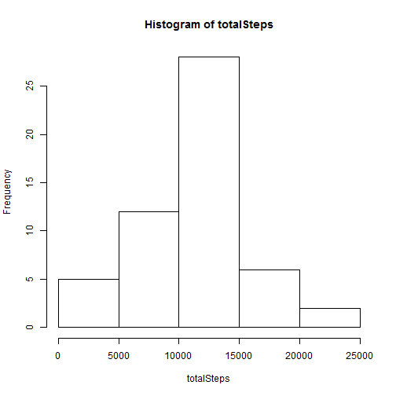
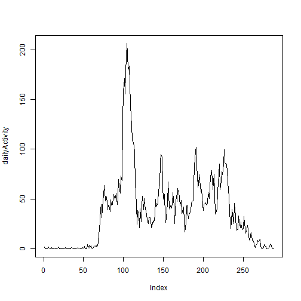
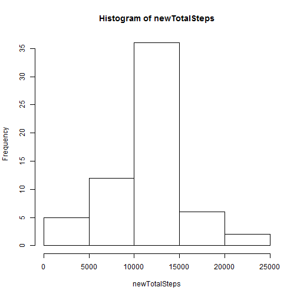
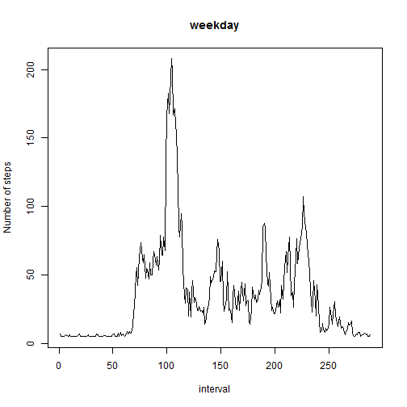
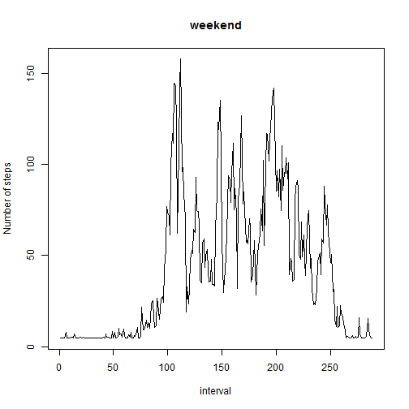

## Loading and preprocessing the data

```r
temp<-"activity.zip"
data <- read.csv(unz(temp, "activity.csv"))
# unlink(temp)
```

## What is mean total number of steps taken per day?

For this part of the assignment, you can ignore the missing values in the dataset.
1.Calculate the total number of steps taken per day

```r
totalSteps<-tapply(data$steps, data$date, sum)
totalSteps
```

```
## 2012-10-01 2012-10-02 2012-10-03 2012-10-04 2012-10-05 2012-10-06 
##         NA        126      11352      12116      13294      15420 
## 2012-10-07 2012-10-08 2012-10-09 2012-10-10 2012-10-11 2012-10-12 
##      11015         NA      12811       9900      10304      17382 
## 2012-10-13 2012-10-14 2012-10-15 2012-10-16 2012-10-17 2012-10-18 
##      12426      15098      10139      15084      13452      10056 
## 2012-10-19 2012-10-20 2012-10-21 2012-10-22 2012-10-23 2012-10-24 
##      11829      10395       8821      13460       8918       8355 
## 2012-10-25 2012-10-26 2012-10-27 2012-10-28 2012-10-29 2012-10-30 
##       2492       6778      10119      11458       5018       9819 
## 2012-10-31 2012-11-01 2012-11-02 2012-11-03 2012-11-04 2012-11-05 
##      15414         NA      10600      10571         NA      10439 
## 2012-11-06 2012-11-07 2012-11-08 2012-11-09 2012-11-10 2012-11-11 
##       8334      12883       3219         NA         NA      12608 
## 2012-11-12 2012-11-13 2012-11-14 2012-11-15 2012-11-16 2012-11-17 
##      10765       7336         NA         41       5441      14339 
## 2012-11-18 2012-11-19 2012-11-20 2012-11-21 2012-11-22 2012-11-23 
##      15110       8841       4472      12787      20427      21194 
## 2012-11-24 2012-11-25 2012-11-26 2012-11-27 2012-11-28 2012-11-29 
##      14478      11834      11162      13646      10183       7047 
## 2012-11-30 
##         NA
```
2.If you do not understand the difference between a histogram and a barplot, research the difference between them. Make a histogram of the total number of steps taken each day

```r
hist(totalSteps)
```

 
3.Calculate and report the mean and median of the total number of steps taken per day


```r
meanSteps<-tapply(data$steps, data$date, mean)
meanSteps
```

```
## 2012-10-01 2012-10-02 2012-10-03 2012-10-04 2012-10-05 2012-10-06 
##         NA  0.4375000 39.4166667 42.0694444 46.1597222 53.5416667 
## 2012-10-07 2012-10-08 2012-10-09 2012-10-10 2012-10-11 2012-10-12 
## 38.2465278         NA 44.4826389 34.3750000 35.7777778 60.3541667 
## 2012-10-13 2012-10-14 2012-10-15 2012-10-16 2012-10-17 2012-10-18 
## 43.1458333 52.4236111 35.2048611 52.3750000 46.7083333 34.9166667 
## 2012-10-19 2012-10-20 2012-10-21 2012-10-22 2012-10-23 2012-10-24 
## 41.0729167 36.0937500 30.6284722 46.7361111 30.9652778 29.0104167 
## 2012-10-25 2012-10-26 2012-10-27 2012-10-28 2012-10-29 2012-10-30 
##  8.6527778 23.5347222 35.1354167 39.7847222 17.4236111 34.0937500 
## 2012-10-31 2012-11-01 2012-11-02 2012-11-03 2012-11-04 2012-11-05 
## 53.5208333         NA 36.8055556 36.7048611         NA 36.2465278 
## 2012-11-06 2012-11-07 2012-11-08 2012-11-09 2012-11-10 2012-11-11 
## 28.9375000 44.7326389 11.1770833         NA         NA 43.7777778 
## 2012-11-12 2012-11-13 2012-11-14 2012-11-15 2012-11-16 2012-11-17 
## 37.3784722 25.4722222         NA  0.1423611 18.8923611 49.7881944 
## 2012-11-18 2012-11-19 2012-11-20 2012-11-21 2012-11-22 2012-11-23 
## 52.4652778 30.6979167 15.5277778 44.3993056 70.9270833 73.5902778 
## 2012-11-24 2012-11-25 2012-11-26 2012-11-27 2012-11-28 2012-11-29 
## 50.2708333 41.0902778 38.7569444 47.3819444 35.3576389 24.4687500 
## 2012-11-30 
##         NA
```

```r
medianSteps<-tapply(data$steps, data$date, median)
medianSteps
```

```
## 2012-10-01 2012-10-02 2012-10-03 2012-10-04 2012-10-05 2012-10-06 
##         NA          0          0          0          0          0 
## 2012-10-07 2012-10-08 2012-10-09 2012-10-10 2012-10-11 2012-10-12 
##          0         NA          0          0          0          0 
## 2012-10-13 2012-10-14 2012-10-15 2012-10-16 2012-10-17 2012-10-18 
##          0          0          0          0          0          0 
## 2012-10-19 2012-10-20 2012-10-21 2012-10-22 2012-10-23 2012-10-24 
##          0          0          0          0          0          0 
## 2012-10-25 2012-10-26 2012-10-27 2012-10-28 2012-10-29 2012-10-30 
##          0          0          0          0          0          0 
## 2012-10-31 2012-11-01 2012-11-02 2012-11-03 2012-11-04 2012-11-05 
##          0         NA          0          0         NA          0 
## 2012-11-06 2012-11-07 2012-11-08 2012-11-09 2012-11-10 2012-11-11 
##          0          0          0         NA         NA          0 
## 2012-11-12 2012-11-13 2012-11-14 2012-11-15 2012-11-16 2012-11-17 
##          0          0         NA          0          0          0 
## 2012-11-18 2012-11-19 2012-11-20 2012-11-21 2012-11-22 2012-11-23 
##          0          0          0          0          0          0 
## 2012-11-24 2012-11-25 2012-11-26 2012-11-27 2012-11-28 2012-11-29 
##          0          0          0          0          0          0 
## 2012-11-30 
##         NA
```
## What is the average daily activity pattern?

1.Make a time series plot (i.e. type = "l") of the 5-minute interval (x-axis) and the average number of steps taken, averaged across all days (y-axis)

```r
dailyActivity<-tapply(data$steps, data$interval, mean, na.rm=TRUE)
plot(dailyActivity, type = "l")
```

 

2.Which 5-minute interval, on average across all the days in the dataset, contains the maximum number of steps?


```r
z<-max(dailyActivity)
a<-dailyActivity==z

names(dailyActivity[a])
```

```
## [1] "835"
```
## Imputing missing values

Note that there are a number of days/intervals where there are missing values (coded as NA). The presence of missing days may introduce bias into some calculations or summaries of the data.

1.Calculate and report the total number of missing values in the dataset (i.e. the total number of rows with NAs)

```r
sum(is.na(data$steps))
```

```
## [1] 2304
```

2.Devise a strategy for filling in all of the missing values in the dataset. The strategy does not need to be sophisticated. For example, you could use the mean/median for that day, or the mean for that 5-minute interval, etc.

The missing values will be replaced with the mean for that day, if there is no data in that day, missing values will be replaced with the mean for the entire data set. 

3.Create a new dataset that is equal to the original dataset but with the missing data filled in.


```r
for (i in unique(data$date)) {
  data[is.na(data$steps)&(data$date==i), 1] <- meanSteps[i]
}

data[is.na(data)] <- mean(data$steps, na.rm=TRUE)
```

4.Make a histogram of the total number of steps taken each day and Calculate and report the mean and median total number of steps taken per day. Do these values differ from the estimates from the first part of the assignment? What is the impact of imputing missing data on the estimates of the total daily number of steps?

```r
newTotalSteps<-tapply(data$steps, data$date, sum)
hist(newTotalSteps)
```

 

```r
newMeanSteps<-tapply(data$steps, data$date, mean)
newMeanSteps
```

```
## 2012-10-01 2012-10-02 2012-10-03 2012-10-04 2012-10-05 2012-10-06 
## 37.3825996  0.4375000 39.4166667 42.0694444 46.1597222 53.5416667 
## 2012-10-07 2012-10-08 2012-10-09 2012-10-10 2012-10-11 2012-10-12 
## 38.2465278 37.3825996 44.4826389 34.3750000 35.7777778 60.3541667 
## 2012-10-13 2012-10-14 2012-10-15 2012-10-16 2012-10-17 2012-10-18 
## 43.1458333 52.4236111 35.2048611 52.3750000 46.7083333 34.9166667 
## 2012-10-19 2012-10-20 2012-10-21 2012-10-22 2012-10-23 2012-10-24 
## 41.0729167 36.0937500 30.6284722 46.7361111 30.9652778 29.0104167 
## 2012-10-25 2012-10-26 2012-10-27 2012-10-28 2012-10-29 2012-10-30 
##  8.6527778 23.5347222 35.1354167 39.7847222 17.4236111 34.0937500 
## 2012-10-31 2012-11-01 2012-11-02 2012-11-03 2012-11-04 2012-11-05 
## 53.5208333 37.3825996 36.8055556 36.7048611 37.3825996 36.2465278 
## 2012-11-06 2012-11-07 2012-11-08 2012-11-09 2012-11-10 2012-11-11 
## 28.9375000 44.7326389 11.1770833 37.3825996 37.3825996 43.7777778 
## 2012-11-12 2012-11-13 2012-11-14 2012-11-15 2012-11-16 2012-11-17 
## 37.3784722 25.4722222 37.3825996  0.1423611 18.8923611 49.7881944 
## 2012-11-18 2012-11-19 2012-11-20 2012-11-21 2012-11-22 2012-11-23 
## 52.4652778 30.6979167 15.5277778 44.3993056 70.9270833 73.5902778 
## 2012-11-24 2012-11-25 2012-11-26 2012-11-27 2012-11-28 2012-11-29 
## 50.2708333 41.0902778 38.7569444 47.3819444 35.3576389 24.4687500 
## 2012-11-30 
## 37.3825996
```

```r
newMedianSteps<-tapply(data$steps, data$date, median)
newMedianSteps
```

```
## 2012-10-01 2012-10-02 2012-10-03 2012-10-04 2012-10-05 2012-10-06 
##    37.3826     0.0000     0.0000     0.0000     0.0000     0.0000 
## 2012-10-07 2012-10-08 2012-10-09 2012-10-10 2012-10-11 2012-10-12 
##     0.0000    37.3826     0.0000     0.0000     0.0000     0.0000 
## 2012-10-13 2012-10-14 2012-10-15 2012-10-16 2012-10-17 2012-10-18 
##     0.0000     0.0000     0.0000     0.0000     0.0000     0.0000 
## 2012-10-19 2012-10-20 2012-10-21 2012-10-22 2012-10-23 2012-10-24 
##     0.0000     0.0000     0.0000     0.0000     0.0000     0.0000 
## 2012-10-25 2012-10-26 2012-10-27 2012-10-28 2012-10-29 2012-10-30 
##     0.0000     0.0000     0.0000     0.0000     0.0000     0.0000 
## 2012-10-31 2012-11-01 2012-11-02 2012-11-03 2012-11-04 2012-11-05 
##     0.0000    37.3826     0.0000     0.0000    37.3826     0.0000 
## 2012-11-06 2012-11-07 2012-11-08 2012-11-09 2012-11-10 2012-11-11 
##     0.0000     0.0000     0.0000    37.3826    37.3826     0.0000 
## 2012-11-12 2012-11-13 2012-11-14 2012-11-15 2012-11-16 2012-11-17 
##     0.0000     0.0000    37.3826     0.0000     0.0000     0.0000 
## 2012-11-18 2012-11-19 2012-11-20 2012-11-21 2012-11-22 2012-11-23 
##     0.0000     0.0000     0.0000     0.0000     0.0000     0.0000 
## 2012-11-24 2012-11-25 2012-11-26 2012-11-27 2012-11-28 2012-11-29 
##     0.0000     0.0000     0.0000     0.0000     0.0000     0.0000 
## 2012-11-30 
##    37.3826
```

```r
newDailyActivity<-tapply(data$steps, data$interval, mean, na.rm=TRUE)
newDailyActivity
```

```
##          0          5         10         15         20         25 
##   6.394439   5.197718   5.017390   5.033784   4.968210   6.722308 
##         30         35         40         45         50         55 
##   5.361652   5.656734   4.902636   6.181325   5.164931   5.017390 
##        100        105        110        115        120        125 
##   5.181325   5.492800   5.033784   5.197718   4.902636   5.869849 
##        130        135        140        145        150        155 
##   6.492800   5.050177   5.050177   5.230505   5.132144   4.902636 
##        200        205        210        215        220        225 
##   4.902636   4.902636   5.886243   4.902636   4.902636   5.017390 
##        230        235        240        245        250        255 
##   4.902636   5.099357   4.902636   4.902636   6.246898   5.722308 
##        300        305        310        315        320        325 
##   4.902636   4.902636   4.902636   4.902636   5.082964   5.443620 
##        330        335        340        345        350        355 
##   6.312472   5.410833   5.328866   4.968210   4.902636   4.902636 
##        400        405        410        415        420        425 
##   5.935423   5.722308   7.132144   4.902636   5.197718   5.214111 
##        430        435        440        445        450        455 
##   8.476407   5.476407   7.935423   5.623947   7.607554   5.869849 
##        500        505        510        515        520        525 
##   4.902636   6.263292   7.509193   6.853456   7.787882   7.476407 
##        530        535        540        545        550        555 
##   6.722308  10.164931  18.820669  20.837062  39.181325  43.558374 
##        600        605        610        615        620        625 
##  32.263292  47.705915  51.623947  60.033784  48.312472  45.804275 
##        630        635        640        645        650        655 
##  50.214111  39.082964  43.148538  43.279685  37.361652  47.509193 
##        700        705        710        715        720        725 
##  42.968210  43.460013  48.787882  52.263292  48.279685  49.197718 
##        730        735        740        745        750        755 
##  53.279685  43.410833  50.312472  65.328866  55.164931  53.689521 
##        800        805        810        815        820        825 
##  68.656734  64.164931 117.361652 141.771488 153.607554 139.919029 
##        830        835        840        845        850        855 
## 158.951816 184.033784 175.132144 160.919029 164.246898 150.017390 
##        900        905        910        915        920        925 
## 129.541980 112.673128  99.705915  98.837062  95.017390  88.279685 
##        930        935        940        945        950        955 
##  62.427226  44.197718  26.443620  38.574767  35.296079  23.197718 
##       1000       1005       1010       1015       1020       1025 
##  40.148538  28.345259  41.755095  50.656734  38.722308  49.033784 
##       1030       1035       1040       1045       1050       1055 
##  43.378046  37.410833  35.050177  29.525587  26.705915  32.656734 
##       1100       1105       1110       1115       1120       1125 
##  32.148538  30.689521  23.427226  27.099357  29.558374  27.902636 
##       1130       1135       1140       1145       1150       1155 
##  33.951816  48.328866  41.427226  43.656734  44.902636  56.328866 
##       1200       1205       1210       1215       1220       1225 
##  60.394439  81.099357  87.312472  85.509193  59.984603  48.492800 
##       1230       1235       1240       1245       1250       1255 
##  52.230505  33.066570  27.951816  37.689521  44.050177  63.361652 
##       1300       1305       1310       1315       1320       1325 
##  41.689521  39.558374  42.492800  40.509193  45.082964  53.935423 
##       1330       1335       1340       1345       1350       1355 
##  42.050177  26.738702  39.623947  51.427226  46.017390  57.738702 
##       1400       1405       1410       1415       1420       1425 
##  53.345259  50.050177  42.771488  47.214111  35.722308  37.525587 
##       1430       1435       1440       1445       1450       1455 
##  41.263292  28.804275  19.771488  27.558374  42.804275  42.935423 
##       1500       1505       1510       1515       1520       1525 
##  30.984603  36.246898  35.738702  38.656734  44.837062  46.394439 
##       1530       1535       1540       1545       1550       1555 
##  46.722308  61.656734  76.935423  90.623947  93.623947  77.853456 
##       1600       1605       1610       1615       1620       1625 
##  58.886243  60.623947  69.673128  59.787882  54.345259  56.837062 
##       1630       1635       1640       1645       1650       1655 
##  43.017390  38.410833  43.705915  44.394439  45.050177  42.853456 
##       1700       1705       1710       1715       1720       1725 
##  45.410833  53.820669  48.968210  58.099357  68.082964  73.492800 
##       1730       1735       1740       1745       1750       1755 
##  64.804275  56.738702  70.148538  54.000997  35.115751  37.443620 
##       1800       1805       1810       1815       1820       1825 
##  40.246898  55.312472  69.804275  79.033784  56.394439  63.787882 
##       1830       1835       1840       1845       1850       1855 
##  72.410833  69.410833  79.050177  91.312472  80.132144  79.279685 
##       1900       1905       1910       1915       1920       1925 
##  78.640341  72.525587  55.328866  51.263292  36.460013  22.902636 
##       1930       1935       1940       1945       1950       1955 
##  28.705915  39.673128  31.148538  27.099357  44.574767  34.033784 
##       2000       2005       2010       2015       2020       2025 
##  21.951816  21.427226  21.705915  33.869849  28.197718  23.296079 
##       2030       2035       2040       2045       2050       2055 
##  28.623947  23.443620  21.886243  23.427226  32.968210  22.410833 
##       2100       2105       2110       2115       2120       2125 
##  18.755095  19.869849  25.279685  21.623947  15.722308  11.869849 
##       2130       2135       2140       2145       2150       2155 
##  17.640341  19.066570  12.443620  11.673128  11.968210   7.181325 
##       2200       2205       2210       2215       2220       2225 
##   6.164931   8.099357   9.082964  12.296079  11.050177  12.460013 
##       2230       2235       2240       2245       2250       2255 
##  13.378046   6.820669   5.181325   5.000997   6.296079   8.902636 
##       2300       2305       2310       2315       2320       2325 
##   7.771488   7.378046   4.902636   5.623947   5.738702   6.279685 
##       2330       2335       2340       2345       2350       2355 
##   7.164931   8.984603   7.771488   5.460013   5.099357   5.837062
```
yes,  these values differ from the estimates from the first part of the assignment. replace missing values with mean of the day will increase the estimates of the total daily number of steps?

## Are there differences in activity patterns between weekdays and weekends?

For this part the weekdays() function may be of some help here. Use the dataset with the filled-in missing values for this part.

1.Create a new factor variable in the dataset with two levels - "weekday" and "weekend" indicating whether a given date is a weekday or weekend day.

```r
data$day<-weekdays(as.POSIXlt(data$date))
for (i in c("Monday","Tuesday","Wednesday","Thursday","Friday")) {
data[data$day==i,4]<-"weekday"
}
for (i in c("Saturday","Sunday")) {
  data[data$day==i,4]<-"weekend"
}
```

2.Make a panel plot containing a time series plot (i.e. type = "l") of the 5-minute interval (x-axis) and the average number of steps taken, averaged across all weekday days or weekend days (y-axis). See the README file in the GitHub repository to see an example of what this plot should look like using simulated data.


```r
weekdayData<-data[data$day=="weekday",]
weekdayDailyActivity<-tapply(weekdayData$steps, weekdayData$interval, mean, na.rm=TRUE)

weekendData<-data[data$day=="weekend",]
weekendDailyActivity<-tapply(weekendData$steps, weekendData$interval, mean, na.rm=TRUE)
#par(mfrow=c(2,1))
plot(weekdayDailyActivity, type = "l", main = "weekday", xlab="interval", ylab="Number of steps")
```

 

```r
plot(weekendDailyActivity, type = "l", main = "weekend", xlab="interval", ylab="Number of steps")
```

 


